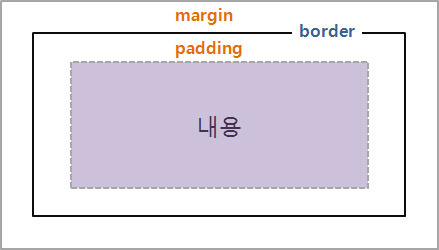

### css property 추천 사이트

- CSS tricks
- colorpicker 사이트 - paletton.com

### 

#### specificity

- specificity - 높을수록 우선 적용됨
- specificity calculator
- 보통 inline styles > ids > class > element 순임

#### Importance

#### Source Order

- 스타일 css 여러개 적용 시 마지막꺼가 적용됨

#### 연습사이트 추천

https://css-diner.netlify.app/

#### 폰트 

google fonts

#### box model

#### PX, EM, REM, %, VW, and VH

https://elementor.com/help/whats-the-difference-between-px-em-rem-vw-and-vh/

#### CSS quiz

https://www.w3schools.com/css/css_quiz.asp (quiz)

https://www.w3schools.com/css/exercise.asp (exercise)

 https://zero-to-mastery.github.io/resources/ (open source docs)