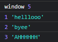
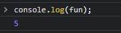

# js 고급(유데미) 2022/03/18

##### 147 scope

- Root scope (window)

```js
var fun = 5;

function funFunction() {
    // child scope
    var fun = "helllooo";
    console.log(1, fun);
}

function funerFunction() {
    // child scope
    var fun = "byee";
    console.log(2, fun);
}

function funestFunction() {
    // child scope
    var fun = "AHHHHHH";
    console.log(3, fun);
}

console.log("window", fun);
funFunction();
funerFunction();
funestFunction();
```





- 함수내부 -> ... ->Root scope로 참조
- 

#### 151 ES5 and ES6

- ECMA internation
- ECMAScript === Javascript

- ES6 --> ECMAScript6
- BABEL - 최신버전의 js로 작성해도(es6, es7) 모든 브라우저에서 돌아갈 수 있도록 변환해주는
  사이트
- 