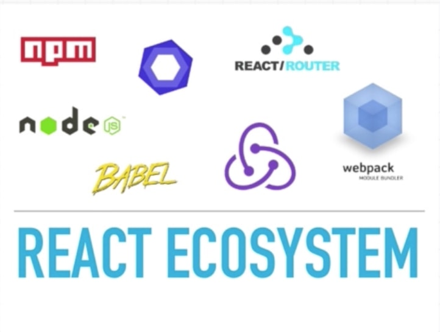

# REACT

- 페이스북이 만듬(페이스북, 인스타, 넷플릭스)
- 안정적이고 일관적임
- 예측가능한 방식

#### 1. thinking of component

- 레고블럭처럼
- 합쳐서 웹사이트를 만듬
- 

- 의존성을 줄임

#### 2. one way data flow

- 데이터가 top to bottom으로만 흐름

#### 3. Virtual DOM

- 가장 최적의 방법으로 DOM에 변경사항 적용해줌

#### 4. Eco-System 이 크다.

- 생태계가 크다.
- 

#### 5. 참조할만한 사이트

- https://create-react-app.dev/docs/getting-started/
- https://medium.com/@maybekatz/introducing-npx-an-npm-package-runner-55f7d4bd282b
- https://marketplace.visualstudio.com/items?itemName=jawandarajbir.react-vscode-extension-pack