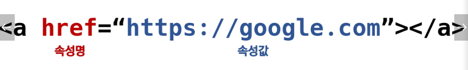

# Web

## HTML (Hyper Text Markup Language)

- 참조(하이퍼링크)를 통해 사용자가 한 문서에서 다른 문서로 즉시 접근할 수 있는 텍스트
- Markup languate(태그 등을 이용하여 문서나 데이터의 구조를 명시, HTML, Markdown)
- 웹 페이지를 작성(구조화)하기 위한 언어

### **html 문서의 기본구조(!+tab)**

- html: 문서의 최상위(root)요소
- head: 문서 메타데이터 요소(문서 제목, 인코딩, 스타일, 외부 파일 로딩 등, 일반적으로 브라우저에 나타나지 않는 내용)
  - title - 브라우저 상단 타이틀
  - meta - 문서 레벨 메타데이터 요소
  - link - 외부 리소스 연결 요소(CSS, favicon)
  - script - 스크립트 요소(JS)
  - style - css 직접 작성
- body: 문서 본문 요소(실제 화면 구성과 관련된 내용)

- element(요소)
  - html의 요소는 태그와 내용으로 구성
  - HTML 요소는 시작 태그와 종료 태그 그리고 사이에 위치한 내용으로 구성
  - 태그는 컨텐츠를 감싸는 것으로 그 정보의 성격과 의미 정의
  - 내용이 없는 태그들 - br, hr, img, input, link, meta
  - 요소는 중첩(nested)될 수 있음 - 요소의 중첩을 통해 하나의 문서를 구조화
- 속성(attribute)
  - 태그별로 사용할 수 있는 속성은 다르다.
  - 
  - 공백 x, 쌍따옴표
  - 속성을 통해 태그의 부가적인 정보 설정, 요소는 속성을 가질 수 있고, 경로나 크기와 같은 추가적인 정보 제공, 요소의 시작 태그에 작성하며, 보통 이름과 값이 하나의 쌍으로 존재, 태그와 상관없이 사용 가능한 속성(HTML Global Attribute)들도 있음
  - HTML Global Attribute
    - id : 문서 전체에서 유일한 고유 식별자 지정
    - class : 공백으로 구분된 해당 요소의 클래스의 목록
    - data-* : 페이지에 개인 사용자 정의 데이터를 저장하기 위해 사용
    - style: inline 스타일
    - title : 요소에 대한 추가 정보 지정
    - tabindex : 요소의 탭 순서

### **DOM**

- Document Object Model 트리
- 텍스트 파일인 **HTML 문서를 브라우저에서 렌더링 하기 위한 구조**
  - HTML 문서에 대한 모델을 구성
  - HTML 문서 내의 각 요소에 접근 / 수정에 필요한 프로퍼티와 메서드를 제공함

### 시맨틱 태그

- **HTML5에서 의미론적 요소를 담은 태그** 등장(기존의 영역 div 태그 대체)
  - header : 문서 전체나 섹션의 헤더(머리말 부분)
  - nav : 네비게이션
  - aside : 사이드에 위치한 공간, 메인 콘텐츠와 관련성이 적은 콘텐츠
  - section: 문서의 일반적인 구분, 컨텐츠의 그룹을 표현
  - article: 문서, 페이지, 사이트 안에서 독립적으로 구분되는 영역
  - footer: 문서 전체나 섹션의 푸터(마지막 부분)
  - 
  - Non semantic 요소는 div, span 등이 있고 **h1, table 태그도 시맨틱 태그**로 볼 수 있음
  - 개발자, 사용자 뿐만 아니라 검색엔진 등에 의미 있는 정보의 그룹을 태그로 표현
  - 단순히 구역을 나누는 것 뿐만 아니라 **'의미'를 가지는 태그들을 활용하기 위한 노력**
  - 요소의 의미 명확, 가독성 up, 유지보수 easy
  - 검색엔진최적화를 위해 메타태그, 시맨틱 태그 등을 통한 마크업을 효과적으로 활용 해야함

### **주요 태그와 속성**

- **table, form, input --> 안나옴**
- a 태그 - href 속성을 활용해 다른 Url로 연결하는 하이퍼 링크
- b, strong - 굵은 글씨
- i, em - 기울임 글씨
- br 텍스트 내에 줄 바꿈
- img - src속성을 활용해 이미지 표현
- span 의미 없는 인라인 컨테이너
- 그룹 컨텐츠
- p - 하나의 문단
- hr - 수평선
- ol - 순서있는 리스트, ul - 순서 없는 리스트
- pre  HTML에 작성한 내용 그대로 표현, 보통 고정폭 글꼴, 공백 문자 유지
- blockquote 텍스트가 긴 인용문
- div 의미 없는 블록 레벨 컨테이너

## CSS(Cascading Style Sheets)

- 스타일을 지정하기 위한 언어 / 선택하고, 스타일을 지정한다.
- 
- CSS 구문은 선택자를 통해 스타일을 지정할 HTML 요소 선택
- 중괄호 안에서는 **속성과 값, 하나의 쌍으로 이루어진 선언 진행**
- 각 쌍은 선택한 요소의 속성, 속성에 부여할 값을 의미
  - **속성** (Property) : 어떤 스타일 **기능을 변경할지 결정**
  - **값** (Value) : 어떻게 **스타일 기능을 변경할지 결정**
- CSS 정의 방법
  - **인라인**, **내부참조**(embedding, **style 태그**), **외부 참조**(link file) - **분리된 CSS 파일, CSS 파일 작성한거 가져옴**

### 단위 (크기, 속성)

- 크기 단위
  - px(픽셀) - 모니터 해상도의 한 화소인 '픽셀' 기준
  - 픽셀의 크기는 변하지 않기 때문에 고정적인 단위
  - % - 백분율 단위
  - 가변적인 레이아웃에서 자주 사용
  - em - (바로 위, 부모 요소에 대한) 상속의 영향을 받음
  - 배수 단위, **요소에 지정된 사이즈에 상대적인 사이즈를 가짐**
  - rem - (바로 위, 부모 요소에 대한) 상속의 영향을 받지 않음
  - **최상위 요소(html)의 사이즈를 기준으로 배수 단위를 가짐**
  - viewport - 웹 페이지를 방문한 유저에게 바로 보이게 되는 웹 컨텐츠의 영역 (디바이스 화면)
  - **디바이스의 viewport를 기준으로 상대적인 사이즈가 결정됨**
  - vw, vh, vmin, vmax

- 색상 단위
  - 색상 키워드 - 대소문자 구분 x, red, blue, black
  - RGB 색상 - 16진수 표기법 혹은 함수형 표기법
  - HSL - 색상, 채도, 명도를 통해 특정 색을 표현하는 방식
  - 

### 선택자 및 우선순위

- 선택자 유형

  - 기본 선택자 - 전체 선택자, 요소 선택자, 클래스 선택자, 아이디 선택자, 속성 선택자
  - 결합자 - 
    - 자손 결합자 -  selector A 하위의 모든 selector B 요소    .box p
    - 자식 결합자 - selector A 바로 아래의 selectorB 요소   .box > p
    - 일반 형제 결합자 - selector A의 형제 요소 중 뒤에 위치하는 selectorB 요소를 모두 선택
      - p ~ span
    - 인접 형제 결합자 - selector A의 형제 요소 중 **바로 뒤**에 위치하는 selectorB 요소를 모두 선택
      - p + span
  - 의사 클래스/요소(Pseudo Class) - 링크, 동적 의사 클래스, 구조적 의사 클래스, 기타 의사 클래스, 의사 엘리먼트, 속성 선택자
  - 
  - 요소 선택자 - HTML 태그를 직접 선택
  - 클래스 선택자 - . 로 시작함, 해당 클래스가 적용된 항목을 선택
  - id 선택자 - # 문자로 시작, 해당 아이디가 적용된 항목 선택, 하나의 문서에 1번만 사용(권장)

- 우선순위(cascading order)

  - CSS 우선순위를 아래와 같이 그룹을 지어볼 수 있다.
    - 1. 중요도 (Importance) -  사용시 주의 (!important)
      2. 우선 순위(Specificity)
         - 인라인 > id > class, 속성, pseudo-class > 요소, Pseudo-element (인아클요(태))
      3. CSS 파일 로딩 순서

  ****

  3과 4의 경우 css파일에서 green이 뒤에있어 그린이 나옴미ㅑ

- CSS 상속
  - CSS는 상속을 통해 부모 요소의 속성을 자식에게 상속
  - 속성 중에는 상속이 되는 것과 되지 않는 것들이 있다.
  - 상속 되는 것 - font, color, text-align, opacity, visibility
  - 상속 되지 않는 것 - box model 관련, position 관련
  - 

### 박스모델

- 모든 요소는 네모(박스모델)이고, 위에서부터 아래로, 왼쪽에서 오른쪽으로 쌓인다.
- 모든 HTML 요소는 box 형태로 되어있음
- 하나의 박스는 네 부분으로 이루어짐
  - content
  - padding
  - border
  - margin
  - 

### 인라인, 블록 요소 특징

- display : block
  - 줄 바꿈이 일어나는 요소
  - 화면 크기 전체의 가로 폭을 차지
  - 블록 레벨 요소 안에 인라인 레벨 요소가 들어갈 수 있음
  - div, ul, ol, li, p, hr, form
  - 블록의 기본 너비는 가질 수 있는 너비의 100%
  - 가질수 없으면 자동으로 margin 부여
- display: inline
  - 줄 바꿈이 일어나지 않는 행의 일부 요소
  - content 너비만큼 가로 폭 차지
  - width, height, margin-top, margin-bottome을 지정할 수 없다.
  - 상하 여백은 line-heigth 로 지정
  - span, a, img, input, label, b, em, i, strong
- display: inline-block
  - block과 inline 레벨 요소의 특징을 모두 가짐
  - inline처럼 한 줄에 표시 가능, block 처럼 width, height, margin 속성 모두 지정 가능

- display: none
  - 해당 요소를 화면에 표시하지 않고, 공간조차 부여 x
  - visibility: hidden 보이지만 않고, 공간은 차지

### Position - static, relative, absolute (out of flow), fixed(out of flow), sticky

- 문서 상에서 요소 위치를 지정
- static : 모든 태그의 기본 값(기준 위치)
  - 일반적인 요소의 배치 순서에 따름(좌측 상단)
  - 부모 요소 내에서 배치될 때는 부모 요소의 위치를 기준으로 배치
- 아래는 좌표 프로퍼티(top, bottom, left, right)를 사용하여 이동 가능
  - relative, absolute, fixed
- relative : 상대위치
  -  **자기 자신의 static 위치를 기준으로 이동**(normal flow 유지)
  - 레이아웃에서 요소가 차지하는 공간은 static과 같음 (normal 대비 offset)
- absolute : 절대 위치
  - 요소를 일반적인 문서 흐름에서 제거 후 **레이아웃에 공간을 차지 x** (normal flow 벗어남)
  - static이 아닌 가장 가까이 있는 **부모/조상 요소를 기준으로 이동** (없는 경우 body)
- fixed : 고정 위치
  - 요소를 일반적인 문서 흐름에서 제거 후 레이아웃에 공간 차지 x
  - 부모 요소와 관계없이 **viewport를 기준으로 이동**
  - 스크롤 시에서 항상 같은 곳에서 위치함

### float 안나옴

### flex - axis, container - item, 각 속성

- 행과 열 형태로 아이템들을 배치하는 1차원 레이아웃 모델
- 축 main axis, cross axis
- 구성요소 flex container, flex item
- Flex container
  - 플렉스박스 레이아웃을 형성하는 가장 기본적인 모델
  - Flex item들이 놓여있는 영역
  - display 속성을 flex 혹인 inline-flex로 지정
- Flex item (자식 요소)
  - 컨테이너에 속해 있는 컨텐츠(박스)

- 배치 설정
  - flex-direction(row, row-reverse, col, col-reverse)
  - flex-wrap(wrap, nowrap)
  - flex-flow(row nowrap 등)
- 공간 나누기
  - justify-content (main-axis)(flex-start, flex-end, center, space-between, space-around, space-evenly)
  - align-content (cross axis)(flex-start, flex-end, center, space-between, space-around, space-evenly)
- 정렬
  - align-items (모든 아이템을 cross axis 기준으로)(stretch, flex-start, flex-end, center, baseline)
  - align-self (개별 아이템)(개별 아이템에 적용, stretch, flex-start, flex-end, center)
- 기타속성
  - flex-grow : 남은 영역을 아이템에 분배
  - order : 배치순서

## 반응형 웹

#### bootStrap

- CDN(content delivery network - 컨텐츠를 효율적으로 전달하기 위해 여러 노드에 가진 네트워크에 데이터를 제공하는 시스템)
- Grid System
  - 요소들의 디자인과 배치에 도움을 주는 시스템
  - 기본 요소
    - column : 실제 컨텐츠를 포함하는 부분
    - Gutter : 칼럼과 칼럼 사이의 공간
    - Container : Column들을 담고 있는 공간
  - 부트스트램 grid system은 flexbox로 제작됨
  - container, rows, column으로 컨텐츠를 배치하고 정렬
  - 12개의 column, 6개의 grid breakpoints
- Breakpoint

\

### 마크업

- 각 태그별 속성
  - 인라인, 블록
  - li -> list-style

### 스타일링

#### 레이아웃

어떠한 display 가지고 있는지 분석, Box bodel

- position
  - 네모 위 네모 => absolute
  - 브라우저 기준 => fixed, sticky

- flex
- Bootstrap Grid System

#### 스타일

- color
- size
- 각 태그별 속성